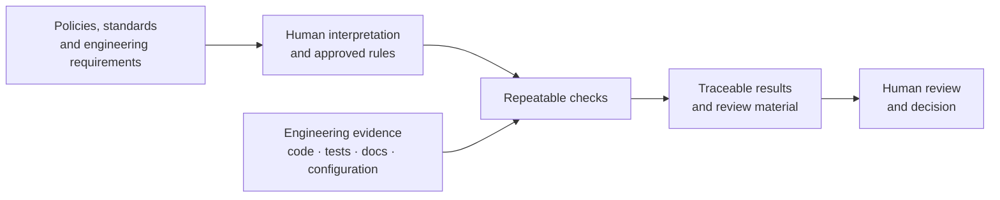
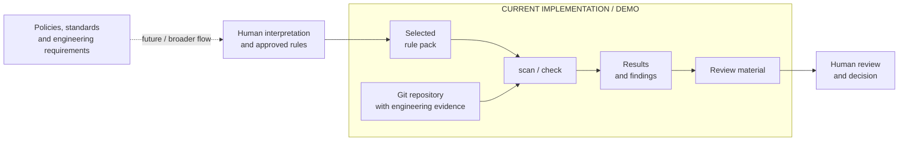

# Curbpack


Curbpack checks a software repository against selected rule packs and prepares results and supporting material for human review. Checks run locally, and the product team can hand the review material to QA, a buyer, or an auditor.

[Documentation](docs/README.md) · [Getting Started](docs/user-guides/getting-started.md) · [White Paper](docs/papers/curbpack-whitepaper.md)

## Vision

Software teams increasingly need to show that a product follows technical requirements, company policies, security rules, standards, and other obligations. The relevant evidence already exists in many projects — in source code, configuration, tests, documentation, build results, and engineering records — but connecting a requirement to the right evidence, checking it consistently, and preparing it for review is still largely manual.

The long-term goal is a traceable path from **a requirement or policy**, through **explicit checks of engineering evidence**, to **a reviewable result**. Automation should do the repetitive checking and preserve where each result came from. Humans remain responsible for interpreting policies, approving rules, reviewing the evidence, and making decisions such as whether a product is ready to release or whether an external requirement has been satisfied.



Curbpack is intended to provide the **repeatable checking and evidence-handling part** of this flow. It should not decide what a law means, invent organizational policy, or make a compliance or release decision on behalf of a person.

## Current State

Curbpack does **not yet implement the full vision**. The current implementation focuses on a useful subset: select versioned rules, inspect a software repository, run repeatable checks against repository evidence, report findings, and prepare the results for human review.

This is also the part that can be demonstrated today. A demo can start with a normal Git repository and a selected rule pack, show what Curbpack finds, run the checks, show which rules pass or produce findings, and follow the resulting material into human review. Capabilities outside this path are either only partly implemented or still planned.




The broader vision includes more complete support for connecting requirements to evidence and review results. Human interpretation and rule selection are already needed in the current workflow.

For a more detailed view, see **[Capability status](docs/curbpack-capability-implementation-audit.md)**, which maps the intended capabilities to what is implemented, partially implemented, and still missing.

## A Simple Example

A pack rule may require `SECURITY.md` to exist and contain vulnerability-reporting information. Curbpack checks the file against the conditions in that rule. If a later commit removes the file or a required heading, running the same check can reveal the change.

The team investigates the finding, updates the product evidence, and runs the check again. A reviewer still needs to decide whether the documented process is suitable and actually followed.

A passing check means that the selected rules passed for the evaluated repository state. It is not certification, CE marking, or a conformity assessment.

## Start Here

Choose a guide for your role. **Builders** use Curbpack in their own product repositories. **Curbpack contributors** develop and maintain Curbpack itself.


| You are                    | Start here                                                                                      |
| -------------------------- | ----------------------------------------------------------------------------------------------- |
| **New user**               | [Install](docs/user-guides/install.md) · [Getting Started](docs/user-guides/getting-started.md) |
| **Builder / product team** | [Builder Guide](docs/user-guides/developers.md) · [CI/CD](docs/user-guides/ci-cd.md)            |
| **Buyer / reviewer**       | [Reviewer Guide](docs/user-guides/reviewers.md)                                                 |
| **Authority / auditor**    | [Reviewer Guide](docs/user-guides/reviewers.md)                                                 |
| **Pack author**            | [Pack Author Guide](docs/user-guides/pack-developers.md)                                        |
| **Curbpack contributor**   | [Contributor Guide](docs/development/README.md) · [Testing](docs/testing/README.md)             |


The CI/CD guide describes checks in a builder's product pipeline. Curbpack's own development and test procedures are covered by the contributor documentation.

For specific tasks, concepts, command details, configuration, and generated files, use the [Documentation Index](docs/README.md).

## Try Curbpack

The [Getting Started walkthrough](docs/user-guides/getting-started.md) uses a disposable reference product. You can inspect a rule, remove or change its evidence, and run the checks again to see how the result changes.

After [installation](docs/user-guides/install.md), you can also inspect your own Git repository:

```bash
cd /path/to/your/product
curbpack scan
```

`scan` is read-only: it does not initialize Curbpack or install repository hooks. Exit `0` means the scan completed; findings may remain.

When you are ready to configure checks for your product, follow the [Builder Guide](docs/user-guides/developers.md). The normal workflow is to select packs, run `curbpack check`, investigate findings, make the necessary changes, and run the check again. Initialization may create starter files or integrations; inspect those changes and replace templates with real product information.

Builders and their coding assistants use the same checks in the product repository. In CI, run `curbpack check` and fail the job on a non-zero exit code. Fix findings in the product work, then let CI check the new revision. Human confirmation and attestation remain human actions.

When preparing a handoff, `curbpack share` assembles review material. A recipient can start with the HTML summary or executive summary and inspect the detailed findings and evidence. See the [Reviewer Guide](docs/user-guides/reviewers.md) for what these results mean and how to review them.

## Release and Pre-Beta Status

The released installer supplies **v0.5.5**. The public GitHub Action remains pinned to `RI-SE/curbpack@v0.5.2`; see the [CI/CD Guide](docs/user-guides/ci-cd.md).


To test the newer source changes, use the [Pre-Beta Guide](vision/docs/getting-started/prebeta.md). From a Curbpack source checkout:

```bash
./scripts/test-prebeta.sh
```

It builds a labelled source version, prepares a sandbox, and records the exact build and results. The released installer supplies an older build.

The existing [Launch Status and Audit Limitations](vision/docs/launch-status.md) records qualification information and known limitations. These status documents remain under `vision/docs/` pending migration.
-->

## Project Background

[RI-SE/curbpack](https://github.com/RI-SE/curbpack) contains the source code, releases, and documentation. Development is supported by RISE as an applied research and competence project; see [NOTICE](NOTICE). RISE does not certify products that use Curbpack results.

The [White Paper](docs/papers/curbpack-whitepaper.md) provides the longer technical background. Earlier documentation and design material are retained under [vision/](vision/); some of that material describes historical decisions or planned capabilities. Use [docs/](docs/README.md) for the current user guides and technical reference.

Curbpack prepares repository evidence for human review. It does not replace legal interpretation, software composition analysis, secret scanning, or other specialist assurance activities.
    