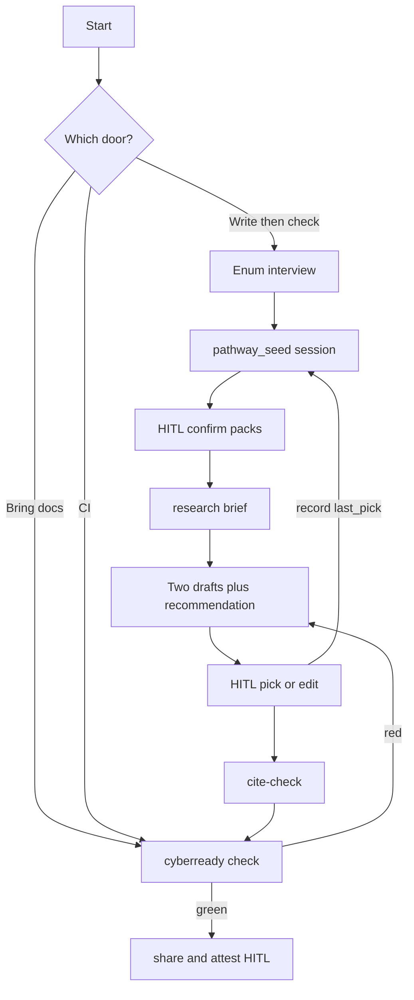

# Warm-start pathway

**Warm-start and research help you choose a draft; only check decides pass/fail—not certification.**

One next ask. Optional two drafts with a recommendation. Then check. Humans confirm and attest—agents never stamp those.

Not conformity assessment. Not CE marking. Not a notified-body opinion.

## Dual doors → one check

| Door | Meaning |
|------|---------|
| **Write→Check** | Optional warm-start: answer a few enums, confirm packs, optional research brief, draft house docs (always **two options + Recommended: A\|B**), cite-check, then check. |
| **Bring-docs→Check** | Put existing policies on pack paths (or map a partner pack), then check. No portal PDF ingest. |
| **CI** | Run `check` alone anytime. |

Either door ends in a review pack for a human to judge and optionally `attest`.



## What you run (human)

```bash
cyberready pathway status          # one plain-English next ask (default)
cyberready pathway suggest --product=… --eu-docs=… --medtech=… --sector=… --house-first=…
# human: pathway confirm-packs
cyberready research                # optional allowlisted brief — never gates check
# agent/human: two drafts + Recommended A|B → you pick → cite-check
cyberready research --cite-check <draft.md>
# human: pathway confirm-prose
cyberready check
cyberready share
# human: pathway confirm-share → attest → verify bound hash in proof/index.html
```

Optional session memory (not a gate input): `cyberready pathway note --set …` / `--forget …` — short notes, corrections, and `last_draft_pick` live in `pathway-seed.json`.

## Dual-draft HITL (always)

When drafting house prose (or remediating red checks with external claims):

1. Read seed (notes / corrections / last pick) + research packet + ContextPack failures.
2. Propose **Option A** and **Option B** (concise; cite ids from the packet).
3. State **Recommended: A|B** with ≤3 reasons.
4. Stop for human pick or edit; then `research --cite-check`; record pick via `pathway note --set last_draft_pick=A|B|edited`.
5. Never invent pack ids or legal conformity.

---

## For agents (below the fold)

Shared phase vocabulary: seed → GateFailure statechart → ContextPack → `pathway status` → local proof verify.

Deterministic closed-world pack suggest → guarded HITL confirms → RKG house draft → check/share → human attest → client-side proof verify.

CLI exit codes remain source of truth. Chat and MCP never stamp confirms or attest. Catalog stays frozen to `house-policy`, `cra-baseline`, `medtech-iec62304` (plus imported partner packs). Pin Action examples at **`@v0.4.3`**.

### Phase vocabulary (canonical)

Parent path (emit everywhere):

`Root / Pathway / {AwaitSuggest|AwaitPackConfirm|AwaitActivate|AwaitHealOrProse|AwaitProseConfirm|AwaitCheck|AwaitShare|AwaitShareConfirm|AwaitAttest|AwaitHPURLVerify}`

Orthogonal regions under pack eval (unchanged): `PackEval` / rule regions in GateFailure. Pathway ticks are **parent path**, not fake pack regions.

Human-only events: `confirm-packs`, `confirm-prose`, `confirm-share`, `attest`. Agents may `suggest` / `status` / `note` / `check` / `share` / heal / propose only. Illegal confirm order → usage exit 2.

### Layers (L0–L10)

| Layer | Job | Machine | Human |
|-------|-----|---------|-------|
| **L0** | Enum seed | `pathway suggest` flags | Answer ≤6 enum questions |
| **L1** | Closed-world packs | Go lookup → frozen trio (+ partner note) | — |
| **L2** | Tick packs | `pathway confirm-packs` (+ RKG export) | Yes / change / house-only |
| **L2.5** | Research sidecar | `cyberready research` (+ optional `--fetch`) | Read brief; not a gate |
| **L3** | Activate | `init --packs` / `check --heal` | — |
| **L4** | House draft | RKG + research packet; **dual draft + recommend**; cite-or-refuse | Pick A/B/edit |
| **L5** | Tick prose | `cite-check` green → `pathway confirm-prose` | “I own this wording” |
| **L6** | Check | `check` (+ hooks); GateFailure path = pathway phase | Fix on red |
| **L7** | Share | `share` (ContextPack includes pathway next) | — |
| **L8** | Tick share | `pathway confirm-share` | Review buyer-Qs / one-pager |
| **L9** | Sign | — | `attest` (OCC / `--allow-dirty`) |
| **L10** | Verify | status → open `proof/index.html` | Paste pointer `state_hash` |

### Closed-world suggest map

| Inputs | `proposed_packs` |
|--------|------------------|
| default / hygiene / house-first | `["house-policy"]` |
| shipping + eu-docs | `["house-policy","cra-baseline"]` |
| medtech=yes | `["medtech-iec62304"]` (extends CRA) |
| sector=other | `["house-policy"]` + `next_hint: write-your-own-pack` |

`--ce-context` is **context only** — never changes packs to CE-positive. Never invent pack ids. Confirm intersects with `packs list` ∪ imported.

```bash
cyberready pathway suggest \
  --product=hygiene \
  --eu-docs=no \
  --medtech=no \
  --sector=none \
  --house-first=yes
```

### Anti-hallucination + passive chat

1. **Pack ids:** only from `pathway suggest` / `packs list` — never invent.
2. **Findings:** only from check JSON / ContextPack / SARIF `ruleId` — never invent gate results.
3. **Law:** no regulation-text KB; L4 navigates **RKG** + **research packet** allowlisted URLs — cite-or-refuse.
4. **Prose:** always two drafts + recommendation; human picks; heal = stubs only.
5. **Ticks / attest:** human CLI only; not MCP. Cite-check refuse blocks `confirm-prose` when packet present.
6. **Claims:** claim-safety + fixed fence on seed + exports.
7. **Enums:** suggest flags are closed sets; reject free strings.
8. **Session notes:** `pathway note` only; never forge seed; notes are **not** check inputs.
9. **Passive chat:** MCP/chat propose only; phase from ContextPack / `pathway status`.

### HITL checklist

- [ ] `pathway suggest` → review `proposed_packs`
- [ ] Human: `pathway confirm-packs` (exports RKG)
- [ ] `cyberready research` (optional `--fetch`) — never gates check
- [ ] Dual draft + Recommended A|B → human pick → `pathway note --set last_draft_pick=…`
- [ ] `init --packs …` + `check --heal` + edit with cite markers
- [ ] `cyberready research --cite-check <draft.md>` green
- [ ] Human: `pathway confirm-prose`
- [ ] `check` green (or shareable red with ContextPack)
- [ ] `share` → human: `pathway confirm-share`
- [ ] Human: `attest` (agents **stop** here)
- [ ] Human: open `proof/index.html` + paste pointer `state_hash`

### Claim fence

Fixed string on every seed write:

> Prepares evidence for human review — not a conformity assessment.

### Seed schema

**Path:** `.github/cyberready/cache/pathway-seed.json`  
**Writer:** only `cyberready pathway`  
**Not** a check pass/fail input.

```json
{
  "schema_version": 1,
  "answers": {
    "product": "hygiene",
    "eu_docs": "no",
    "medtech": "no",
    "sector": "none",
    "house_first": "yes",
    "ce_context": "none"
  },
  "proposed_packs": ["house-policy"],
  "human_ticks": {
    "packs_confirmed": false,
    "prose_owned": false,
    "share_reviewed": false
  },
  "session_notes": [],
  "corrections": {},
  "last_draft_pick": "",
  "claim": "Prepares evidence for human review — not a conformity assessment."
}
```

`session_notes`, `corrections`, and `last_draft_pick` are local session IP (preference trail). They never change gate pass/fail. Deferred later: separate weights file / overlay graph CLI / draft generator.

### Smoke path

```bash
cyberready pathway status
cyberready pathway suggest --product=hygiene --eu-docs=no --medtech=no --sector=none --house-first=yes
# human:
cyberready pathway confirm-packs
cyberready init --packs house-policy
cyberready research
cyberready check --heal
# dual draft + recommend → human pick →:
cyberready pathway note --set last_draft_pick=A
cyberready research --cite-check SECURITY.md
# human:
cyberready pathway confirm-prose
cyberready check
cyberready share
# human:
cyberready pathway confirm-share
# STOP — human only: attest → proof/index.html verify
```

Agents print the next `pathway status` line and wait. MCP has **no** confirm/attest tools. Proof verify stays off home/builders — pathway / proof / for-reviewers only.

## Related

- [Assistant loop](../assistant-loop.md) · [Cold start](house-policy-cold-start.md) · [60-second paths](60-second-paths.md) · [Buyer evidence](buyer-evidence.md)
- [Write your own pack](../write-your-own-pack.md) · [Voice and terms](../voice-and-terms.md) · [Stable contracts](../stable-contracts.md)
