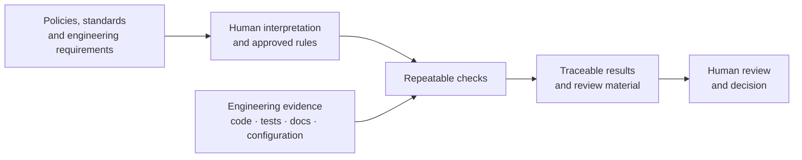
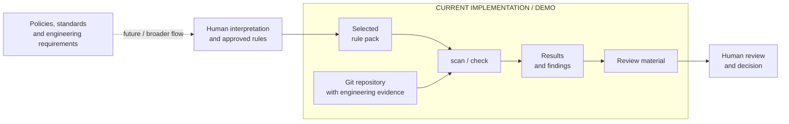

# Curbpack documentation
# Curbpack

## Vision

Software teams increasingly need to show that a product follows technical requirements, company policies, security rules, standards, and other obligations. The relevant evidence already exists in many projects — in source code, configuration, tests, documentation, build results, and engineering records — but connecting a requirement to the right evidence, checking it consistently, and preparing it for review is still largely manual.

The long-term goal is a traceable path from **a requirement or policy**, through **explicit checks of engineering evidence**, to **a reviewable result**. Automation should do the repetitive checking and preserve where each result came from. Humans remain responsible for interpreting policies, approving rules, reviewing the evidence, and making decisions such as whether a product is ready to release or whether an external requirement has been satisfied.

Curbpack is intended to provide the **repeatable checking and evidence-handling part** of this flow. It should not decide what a law means, invent organizational policy, or make a compliance or release decision on behalf of a person.

## Current state

Curbpack does **not yet implement the full vision**. The current implementation focuses on a useful subset: select versioned rules, inspect a software repository, run repeatable checks against repository evidence, report findings, and prepare the results for human review.

This is also the part that can be demonstrated today. A demo can start with a normal Git repository and a selected rule pack, show what Curbpack finds, run the checks, show which rules pass or produce findings, and follow the resulting material into human review. Capabilities outside this path are either only partly implemented or still planned.

The diagrams above show the distinction between the **intended system** and the **subset implemented today**. This is intentional in the documentation: future capabilities should remain visible without being presented as shipped functionality.

For a more detailed view, see **[Capability status](curbpack-capability-implementation-audit.md)**, which maps the intended capabilities to what is implemented, partially implemented, and still missing.

---

Start with the shortest path for what you need to do.

## Start here

| Goal                                                      | Read                                            |
| --------------------------------------------------------- | ----------------------------------------------- |
| Install Curbpack                                          | [Install Curbpack](guides/install.md)           |
| Try Curbpack on the reference product                     | [Getting started](guides/getting-started.md)    |
| Use Curbpack in a product repository                      | [Developer guide](guides/developers.md)         |
| Run Curbpack in CI/CD                                     | [CI/CD guide](guides/ci-cd.md)                  |
| Review Curbpack results, evidence, and review material | [Reviewer guide](guides/reviewers.md)           |
| Write or maintain a rule pack                          | [Pack development](guides/pack-developers.md)   |

## Common tasks

| Task                                                            | Read                                                  |
| --------------------------------------------------------------- | ----------------------------------------------------- |
| Select and configure packs                                      | [Configuration reference](reference/configuration.md) |
| Understand how packs work                                       | [Packs](concepts/packs.md)                            |
| Understand repository evidence and results                      | [Evidence](concepts/evidence.md)                      |
| Understand the main Curbpack flow, including `scan` and `check` | [Concepts overview](concepts/README.md)               |
| Prepare material for another person to review                   | [Developer guide](guides/developers.md)               |
| Review received material                                        | [Reviewer guide](guides/reviewers.md)                 |
| Create or maintain a custom pack                                | [Pack development](guides/pack-developers.md)         |
| Run the verification test suites                                | [Testing](testing/README.md)                          |

## Understand Curbpack

| Subject                                                | Read                                         |
| ------------------------------------------------------ | -------------------------------------------- |
| What Curbpack does and how the main parts fit together | [Concepts overview](concepts/README.md)      |
| Packs and rules                                        | [Packs](concepts/packs.md)                   |
| Evidence and review material                           | [Evidence](concepts/evidence.md)             |
| Current implementation architecture                    | [Architecture](contributing/architecture.md) |

## Reference

Use the reference documentation when you need exact commands, fields, paths, or output formats.

| Reference                                   | Purpose                                                     |
| ------------------------------------------- | ----------------------------------------------------------- |
| [CLI](reference/cli.md)                     | Commands, flags, aliases, and exit codes                    |
| [Configuration](reference/configuration.md) | `.curbpack.json`, pack selection, and environment variables |
| [Packs](reference/packs.md)                 | Pack schema, rule fields, check types, and composition      |
| [Outputs](reference/outputs.md)             | Generated files, formats, and locations                     |

## Testing

The verification documentation is separate from normal product documentation.

Start with:

* [Testing overview](testing/README.md)
* [Test strategy](testing/strategy.md)
* [Requirements traceability](testing/requirements_traceability.md)

Executable test material is under the repository-level `testing/` directory.

## Working on Curbpack itself

For contributors working on the Curbpack implementation:

* [Contributing](contributing/README.md)
* [Architecture](contributing/architecture.md)
* [Testing](testing/README.md)

## Papers and background material

Longer background and research material is kept under:

* [Papers](papers/)

These documents provide context and discussion. They are not the primary source for command or configuration behavior.
