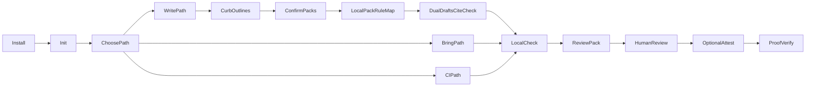

# Curbpack White Paper

**Local evidence preparation for human review**

Curbpack checks your repository against local rule packs and writes a review pack you can hand to a buyer or auditor—on your machine, without claiming certification.

> Not conformity assessment. Not CE marking. Not a notified-body opinion.

Canonical voice: [`docs/voice-and-terms.md`](../docs/voice-and-terms.md). Public site: [https://ri-se.github.io/curbpack/](https://ri-se.github.io/curbpack/) (optional mirror: [afelin.github.io/curbpack](https://afelin.github.io/curbpack/)). Pin Action / examples at **`@v0.5.2`**.

---

## 1. Problem

Software suppliers must show documentation and dependency hygiene against house rules or regulatory-shaped checklists. Spreadsheets drift. Cloud governance-risk-compliance (GRC) platforms move source of truth off the machine and blur who decided what.

Teams need a local habit: check the tree, write evidence humans can hand to a buyer or auditor, and keep judgment with people—not a certificate of conformity.

## 2. Position

Curbpack is a **local-first command-line interface (CLI)**. It evaluates **rule packs** (JSON rule sets) against a git repository, emits machine- and human-readable findings, and can bind a reproducible state digest into Git Notes.

- Packs are **data** (checklists shaped like regulatory annex drafts—not law).
- Default cold start is **house-policy**. Cyber Resilience Act (CRA)–shaped packs are opt-in only.
- Humans retain judgment; gate pass means gates passed on this tree for human review.
- Development is supported by RISE Research Institutes of Sweden as an applied research / competence object. RISE funds and hosts credibility surfaces; it does **not** certify products that use Curbpack gate results.

## 3. Runtime model and evidence flow

```
┌─────────────┐     ┌──────────────┐     ┌─────────────────┐
│  Pack JSON  │────▶│  Validate    │────▶│ GateFailure IR  │
│  (embedded  │     │  engine      │     │ JSON + markdown │
│  or dir)    │     └──────────────┘     └────────┬────────┘
└─────────────┘                                   │
                                                  ▼
                                    ┌─────────────────────────┐
                                    │ Review pack / evidence  │
                                    │ + optional attest note  │
                                    └─────────────────────────┘
```

- **Engine:** industry-agnostic check kinds (`file_present`, `text_forbid`, dependency bans, etc.).
- **Packs:** data only — CRA-shaped annex drafts, house policy, sector templates.
- **No remote policy service** required for daily `check`.
- **Thin MCP example** shells out to CLI; optional Unix sock sidecar (`curbpack-sock` in `examples/mcp/`) for integrators — not in the main binary.

### End-to-end flow



**Write path:** curb outlines → human confirm-packs → local pack→rule map → optional dual drafts + cite-check → check.
**Bring and CI:** skip outlines; go straight to check.
**After green:** review pack → human review → optional attest → local proof verify.

## 4. Three ways in and curb outlines

Every path ends in the same local `check`. Optional drafts never replace check.

| Way | Meaning |
|-----|---------|
| **Write→Check** | Build **curb outlines** via the pathway warm-start (answer a few enums; CLI suggests closed-world packs), human `confirm-packs`, optional research brief, **dual drafts** with **Recommended: A\|B**, cite-check (refuses uncited Claims), human `confirm-prose`, then check. |
| **Bring-docs→Check** | Place existing policies on pack paths (or point a custom pack JSON at your paths), then check. **Skips curb outlines.** No portal PDF ingest. |
| **CI** | Run `check` alone (Action `@v0.5.2` on Linux/macOS runners, or local). **Skips curb outlines.** |

**Curb outlines** (your pathway sketch) are the first Write-path step: a soft local sketch of *what you are curbing* (product posture, house-first, sector)—not pack gates, not regulation, and not the law. The CLI alone writes `.github/curbpack/cache/pathway-seed.json`. Seed and research packets are **not** check pass/fail inputs. Humans stamp confirms (`confirm-packs` / `confirm-prose` / `confirm-share`) on a TTY, with `--i-am-human`, or `CURBPACK_ALLOW_CONFIRM=1`. Agents may `status` / `suggest` / `note` / `check` / `share` only—never forge ticks or invent pack ids.

### Local pack→rule map

After human `confirm-packs`, Curbpack builds a **local pack→rule map** (closed-world suggest → confirm → local map → drafts). Use it to navigate house drafting; it is not regulation text and does not replace check. Optional refresh: `curbpack packs export-graph`.

Mnemonic: *Curb outlines → packs → check → hand off.*

## 5. Capability matrix

| Input | Operation | Output | Human decision |
|-------|-----------|--------|----------------|
| Git repo + pack JSON | `init` | Scaffold, hooks, skill, `.curbpack.json` | Choose packs; confirm pathway if Write |
| Pathway enums | `pathway suggest` | Closed-world pack suggestions in seed | `confirm-packs` (TTY / `--i-am-human`) |
| Confirmed packs | `packs export-graph` | Local pack→rule map JSON | Use map to steer drafts—not as law |
| Repo tree | `check` / `validate` | GateFailure IR (JSON + markdown); exit 0/1/2 | Remediate on red; never invent green |
| GateFailure JSON | `ask --propose` | Propose-only remediation hints | Apply in editor; re-check |
| Allowlisted URLs | `research [--fetch]` | Citation packet + human brief | Inform drafts; never gates check |
| Draft markdown | `research --cite-check` | Pass/fail on uncited Claims | Fix cites before `confirm-prose` |
| Dual drafts | Assistant + human | Option A / B + Recommended A\|B | Pick A, B, or edit; record via `pathway note` |
| Green tree | `share` / `prepare-release` | Review pack + buyer one-pager | `confirm-share`; hand to buyer |
| Ready state | `attest` | Git Notes capsule + SBOM/VEX drafts | Human sign-off; unsigned ≠ verified |
| Attest capsule | `proof/index.html` | Local hash compare | Human judgment—not conformity assessment |

## 6. Feature surface (shipped)

| Area | What it does |
|------|----------------|
| **Init / doctor / demo** | Scaffold house-policy (hooks, skill, IDE); environment confidence; sandbox check (`demo` opens a browser only with `--open`) |
| **check / validate** | Daily gates; `--heal` adds missing stubs only; dual-rep JSON + markdown |
| **ask --propose** | Explain GateFailure JSON; propose-only remediations |
| **pathway** | Warm-start: `status`, `suggest`, `note`, human `confirm-*` |
| **research / cite-check** | Allowlisted citation packet + human brief; never gates check; cite-or-refuse before `confirm-prose` |
| **export / share** | SARIF, ContextPack, buyer-questions, lay-of-land, explain-packet; `share` = check → context-pack → buyer-questions → prepare-release |
| **prepare-release / attest** | Review pack + buyer one-pager; human Git Notes capsule (never auto-attest) |
| **proof verify** | After attest, open local `proof/index.html` and compare the evidence pointer hash—still human judgment |
| **packs** | `list` / `import` / local pack→rule map (`export-graph`) / `doctor` |
| **Platforms** | Release binaries: `darwin_*`, `linux_*`, `windows_amd64` (local CLI). GitHub Action = **Linux/macOS only** |
| **Action / alias** | `afelin/curbpack@v0.5.2`; short alias `curb` = `curbpack` |
| **Optional MCP** | Thin wrapper over CLI (`examples/mcp`); no confirm/attest tools |

Exit codes remain authoritative: **0** pass · **1** gates/error · **2** usage/env.

## 7. Worked example

1. **Curb outlines (Write path)** — `curbpack pathway status` → `pathway suggest …` → human `confirm-packs` → optional `research` → dual drafts + Recommended A\|B → human pick → `research --cite-check` → human `confirm-prose`.
2. **Red findings** — e.g. missing `SECURITY.md`, forbidden claim-adjacent wording, incomplete dependency pin note. `curbpack check` exits non-zero; machine-readable findings (JSON) and a short markdown report list severity and remediation.
3. **Remediate** — add the disclosure path, remove certification theater, record the pin; optionally `curbpack check --heal` for missing stubs only; `curbpack ask … --propose` for propose-only hints.
4. **Re-check** — gates passed on this tree (exit 0). Local gate score is not certification.
5. **Review pack** — `curbpack share` (or `prepare-release`) writes layered reports and a buyer one-pager (supplier evidence summary). Human `confirm-share` when reviewing handoff.
6. **Optional attest** — a human runs `attest` when ready. Until ssh-agent signed: **UNSIGNED — not cryptographically verified**. Then open `proof/index.html` vs the evidence pointer.

Bring and CI skip step 1 and go straight to check. A committed teaching sample (before/after): [`site/samples/onepager.html`](../site/samples/onepager.html).

## 8. Evidence catalog and trust levels

| Artifact | Trust level (honest) |
|----------|----------------------|
| Gate JSON / action report | Structural evidence — reproducible locally; not a legal finding |
| SARIF export | Same gates in CI/IDE format — not certification |
| Buyer-questions / ContextPack / lay-of-land | Human checklist, washed assistant snapshot, map — not a CVE product |
| Pathway seed / research packet | Session + citation trail — informational; not gate inputs |
| Review pack / buyer one-pager | Procurement snapshot — not a certificate of conformity |
| CycloneDX SBOM / OpenVEX drafts | Best-effort inventory and draft notes |
| Git Notes attest capsule | **ssh-agent-signed** = signature present; **unsigned** ≠ verified |
| Explain-packet | Sanitized tutor surface — never greenlights gates |

**Unsigned ≠ verified.** Green readiness % is a **local gate score on this tree**, not a certification score. Daily `check` does not generate or open the one-pager.

## 9. Attestation and install integrity

State hash seed: `commit|parent|sbom_digest|vex_digest` (no wall-clock in the hash).

| State | Meaning |
|-------|---------|
| `ssh-agent-signed` | Real SSH signature produced |
| `not-verified` / unsigned | Capsule present; **not** cryptographically verified |

Synthetic `agent-bind:` tokens are never accepted as verified signatures.

Install paths (`install.sh`, `install.ps1`, GitHub Action) verify release `checksums.txt` with sha256 and fail closed on mismatch. Network pack updates require a sha256 pin; offline import is preferred. `curbpack doctor --repair` re-asserts PATH + alias **locally** — it does **not** download or auto-update.

## 10. Non-claims and RISE neutrality

Curbpack does not:

- Certify conformity or grant CE marking
- Replace notified bodies, auditors, or legal counsel
- Guarantee absence of vulnerabilities
- Claim that green gates equal market access

Development supported by RISE Research Institutes of Sweden as an applied research / competence object. RISE does not certify products that use Curbpack gate results. Public Pages under RI-SE are a credibility home—not an endorsement of adopter products.

Never claim “RISE-approved,” “NCSC-approved,” or agency-endorsed product claims. Public wording: [promotion firewall](../docs/promotion-firewall.md) · [voice and terms](../docs/voice-and-terms.md). CI enforces via `scripts/claim-safety.sh`.

## 11. Limitations

- Pack coverage is only as good as pack authors; thin packs create false confidence.
- Regex and text checks are heuristics with size/time guards — not full program analysis.
- SBOM/VEX generation is best-effort from common Node lockfiles.
- Local CLI ships for darwin / linux / windows_amd64. GitHub Action runners are **Linux/macOS only**. Integrator sock sidecar is Unix-only under `examples/mcp/cmd/curbpack-sock`.
- `doctor --repair` is local PATH/alias repair — not silent auto-update; missing binary requires a full reinstall.
- Client-side hash-pointer verify does not imply remote notary services.
- Pathway suggest is closed-world (frozen catalog + imported partner packs); it does not invent regulation text or pack ids.

## 12. Glossary

| Term | Meaning in this paper |
|------|------------------------|
| **CE** | European conformity marking — Curbpack does not issue CE marks |
| **CRA** | EU Cyber Resilience Act — shapes some pack drafts; gate green ≠ legal conformity |
| **Curb outlines** | Write-path warm-start pathway sketch (enums / suggested packs)—not pack gates and not the law |
| **Pathway** | Optional warm-start CLI (`pathway status\|suggest\|confirm-*\|note`); seed is not a gate input |
| **Dual-draft HITL** | Option A + Option B + Recommended A\|B; human picks; then cite-check |
| **Cite-check** | Refuses uncited Claims against the research packet before `confirm-prose` |
| **Research brief** | Allowlisted Sources for writers — never gates check |
| **SBOM** | Software Bill of Materials (e.g. CycloneDX drafts) |
| **SARIF** | Static Analysis Results Interchange Format for CI/IDEs |
| **GRC** | Governance, Risk, Compliance platforms — not what Curbpack is |
| **Rule pack** | JSON checklist of gates; data, not hard-coded law |
| **Review pack** | Evidence folder for human review |
| **Buyer one-pager** | Supplier evidence summary HTML |
| **ContextPack** | Washed assistant snapshot (`export --context-pack`) |
| **Structural evidence** | Documentation and dependency checks for humans |
| **Notified body** | Independent conformity-assessment organization — not replaced by this tool |
| **Conformity assessment** | Formal legal process — Curbpack prepares human-review evidence only |
| **VEX** | Vulnerability Exploitability eXchange — draft OpenVEX at attest |
| **ReDoS** | Regular expression denial-of-service — packs are length/time guarded |
| **OPA** | Open Policy Agent — explicit non-goal for OSS |

Full audience map: [`docs/glossary-and-audience.md`](../docs/glossary-and-audience.md). Authorities brief: [`docs/for-authorities.md`](../docs/for-authorities.md). Pathway depth: [`docs/getting-started/pathway.md`](../docs/getting-started/pathway.md).

## 13. Related surfaces

- Product narrative: [https://ri-se.github.io/curbpack/](https://ri-se.github.io/curbpack/) (optional mirror: [afelin.github.io/curbpack](https://afelin.github.io/curbpack/))
- How it works / builders: site `how-it-works/` · `for-builders/`
- Adoption clarity: `docs/intent-vs-scope.md`
- Authorities / CISO: `docs/for-authorities.md`
- Security plain language: `docs/security-model.md`
- Install and commands: repository README
- Voice canon: `docs/voice-and-terms.md`
- Assistant contract: `docs/assistant-loop.md`

---

*Document version aligned with Curbpack open-source line `@v0.5.2`. No go-to-market playbooks or CI runbooks are included here by design.*
